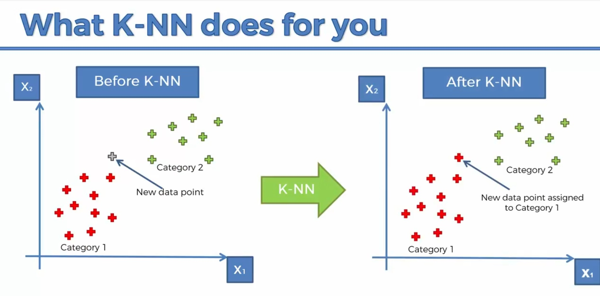
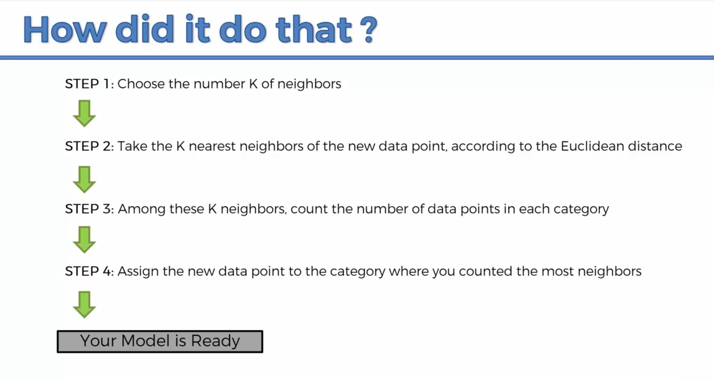
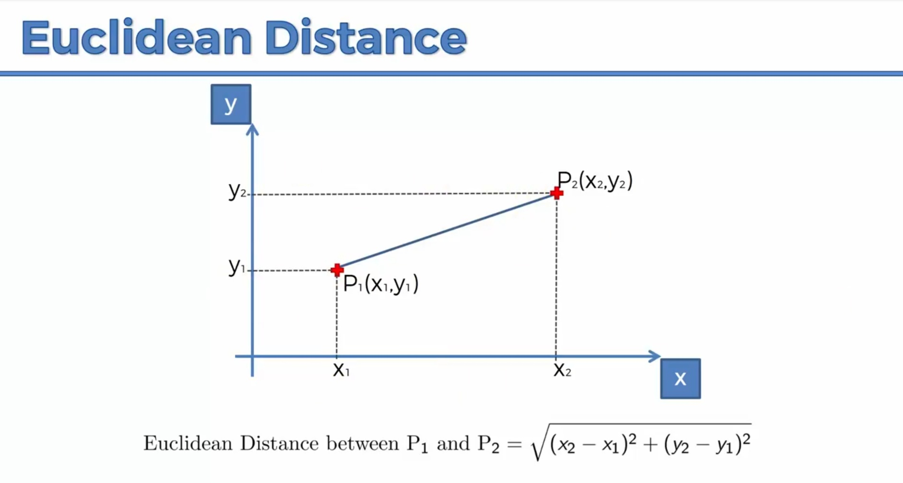

# K Nearest Neighbors

KNN works by finding the distances between a query and all the examples in the data, selecting the specified number examples (K) closest to the query, then votes for the most frequent label (in the case of **classification**) or averages the labels (in the case of regression).It is used for both classification and regression.

It is a supervised learning algorithm. So we store all the data-points and labels. Suppose we have two class with data-points and labels. Suppose we get a new point and we want to predict to which category to it belongs. 

So **KNN** helps here. 

### How it helps ?

We choose the K. Generally 5 is choosed. Increasing K will increase the efficiency but slow down. We take the majority vote . There is no training required . All the work happens at query time. So training time is O(1). 

We calculate distance of current points from all other points. So suppose there are n points. So we will sort it and compare then it take O(nlogn) .

It is a non-parametric algorithm . Learning is zero , we aren't going to learn any parameter. 

**It is used as a Baseline Algorithm for other Algorithm. Any algorithm we are going to use should have better accuracy then KNN Algorithm.**

### What is Euclidean Distance ??

To Check Implementation of KNN Algorithm. Check Out KNN Algorithm.ipynb
